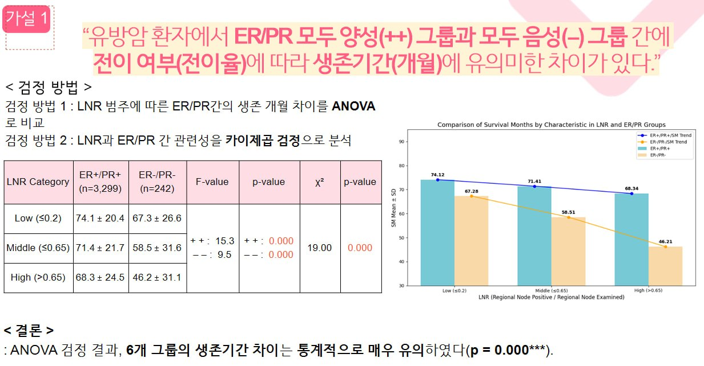
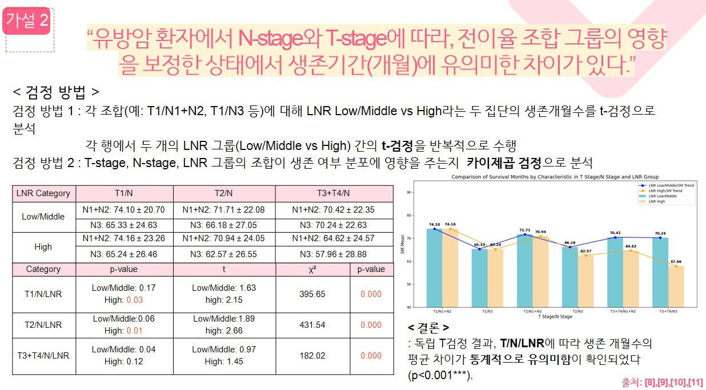
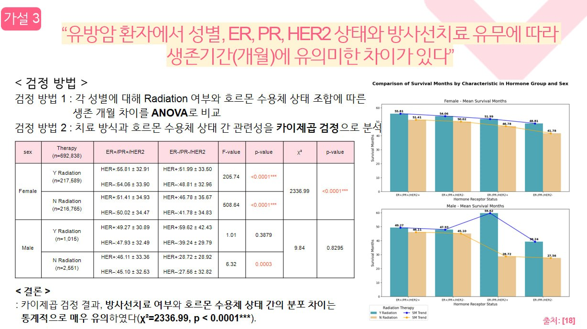
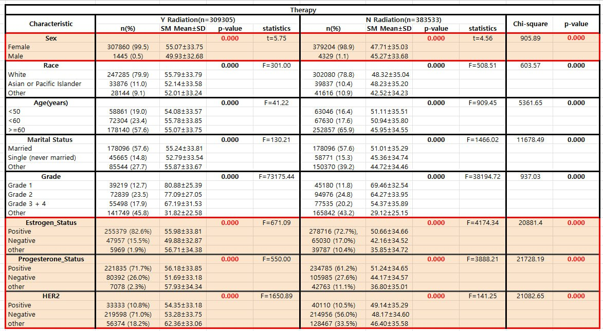
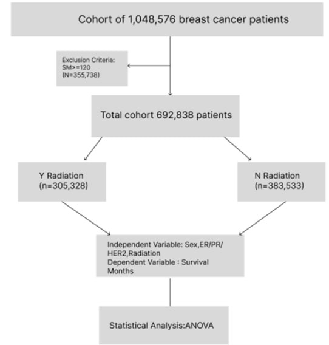

# Breast Cancer Survival Factor Analysis

대규모 임상 데이터를 기반으로 유방암 환자의 생존기간에 영향을 주는 요인을 통계적으로 검증한 분석 프로젝트입니다.

> **1,048,576명 규모의 SEER 코호트에서 시작해 692,838명으로 정제한 뒤,**  
> **가설 설정 -> 전처리 -> 통계 검정 -> 시각화**까지 전 과정을 직접 수행했습니다.

---

## 한눈에 보기

- **무엇을 했나**: 유방암 환자의 생존기간 차이를 설명하는 임상·병리학적 요인을 선정하고, 통계적 가설 검정으로 유의성을 검증
- **왜 의미 있나**: 단순 EDA가 아니라, 논문 기반 가설을 실제 환자 데이터에 재현해 검증하는 구조로 분석 수행
- **어디에 강점이 있나**: 대규모 코호트 정제, 가설 중심 분석, ANOVA / t-test / chi-square 기반 검정 파이프라인
- **핵심 결과**: 설정한 3개 가설 모두 유의수준 `p < 0.001`에서 통계적으로 유의함을 확인

---

## 프로젝트 개요

유방암 환자의 생존율은 호르몬 수용체 상태, 림프절 전이 비율, 종양 진행 정도, 방사선 치료 여부 등 다양한 임상 요인에 따라 달라집니다.

이 프로젝트는 SEER 실제 환자 데이터를 기반으로,
- 논문에서 반복적으로 언급되는 핵심 임상 변수를 선정하고
- 변수 간 관계를 통계 가설로 정리한 뒤
- 실제 환자 데이터에서 생존기간 차이를 검정하는 것을 목표로 했습니다.

즉, **의료 도메인 지식을 데이터 분석 가설로 변환하고, 이를 대규모 실데이터로 검증한 프로젝트**입니다.

---

## 분석 목표

- 유방암 환자 생존기간에 영향을 주는 주요 임상 변수를 식별
- 논문 기반 가설을 실제 데이터로 재현 및 검증
- 데이터 정제, 파생 변수 생성, 통계 검정, 시각화까지 전 과정 직접 수행

---

## 데이터와 처리 규모

### 데이터 소스
- **SEER (Surveillance, Epidemiology, and End Results) Database**

### 처리 규모
- 총 코호트: **1,048,576명**
- 제외 기준 적용 후 최종 분석 대상: **692,838명**
- Radiation 기준 분포:
  - Y Radiation: **305,328명**
  - N Radiation: **383,533명**

### 핵심 변수

| 변수 | 설명 |
|------|------|
| **ER** | Estrogen Receptor |
| **PR** | Progesterone Receptor |
| **HER2** | Human Epidermal growth factor Receptor 2 |
| **LNR** | Lymph Node Ratio (전이 림프절 비율) |
| **T-Stage** | 원발 종양의 크기 및 침윤 정도 |
| **N-Stage** | 림프절 전이 여부 및 범위 |
| **RT** | Radiation Therapy (방사선 치료 여부) |

---

## 분석 가설과 결과

### 가설 1 - ER/PR 상태와 LNR에 따른 생존기간 차이

> "ER/PR 모두 양성(++) 그룹과 모두 음성(--) 그룹 간에 전이 여부(LNR)에 따라 생존기간에 유의미한 차이가 있다."

**검정 방법**
- LNR 범주에 따른 ER/PR 그룹별 생존 개월 차이 -> **ANOVA**
- LNR과 ER/PR 그룹 간 관련성 -> **카이제곱 검정**

**결과**
- 6개 그룹 간 생존기간 차이가 통계적으로 매우 유의함
- **p = 0.000***

<p align="center">
  
</p>

---

### 가설 2 - N-stage, T-stage, LNR 조합에 따른 생존기간 차이

> "N-stage와 T-stage에 따라, 전이율 조합 그룹의 영향을 보정한 상태에서 생존기간에 유의미한 차이가 있다."

**검정 방법**
- 각 T/N 조합에서 LNR Low/Middle vs High 간 생존 개월 차이 -> **독립 t-test**
- T-stage, N-stage, LNR 조합과 생존 여부 분포 -> **카이제곱 검정**

**결과**
- T/N/LNR 조합에 따른 생존 개월 평균 차이가 통계적으로 유의함
- **p < 0.001***

<p align="center">
  
</p>

---

### 가설 3 - 성별, 호르몬 수용체 상태, 방사선치료 여부에 따른 생존기간 차이

> "성별, ER, PR, HER2 상태와 방사선치료 유무에 따라 생존기간에 유의미한 차이가 있다."

**검정 방법**
- 성별별 Radiation 여부 + 호르몬 수용체 상태 조합에 따른 생존 개월 차이 -> **ANOVA**
- 치료 방식과 호르몬 수용체 상태 간 관련성 -> **카이제곱 검정**

**결과**
- 방사선치료 여부와 호르몬 수용체 상태 간 분포 차이가 통계적으로 매우 유의함
- **chi-square = 2336.99, p < 0.0001***

<p align="center">
  
</p>

<p align="center">
  
</p>

---

## 주요 인사이트

- **ER/PR 수용체 상태**와 **LNR**은 생존기간 차이를 설명하는 핵심 변수로 확인됨
- T-stage와 N-stage가 높을수록 LNR High 그룹의 생존기간이 더 짧아지는 경향이 확인됨
- 방사선치료 여부는 호르몬 수용체 상태와 강한 관련성을 보였고, 생존기간 차이와도 연결됨
- 설정한 **3개 가설 모두 p < 0.001 수준에서 유의**함을 확인

---

## 분석 플로우

<p align="center">
  
</p>

이 프로젝트는 다음 순서로 진행했습니다.
1. 논문 리서치 기반 변수 선정
2. SEER 데이터 정제 및 분석용 코호트 구성
3. LNR 등 파생 변수 생성
4. 가설별 통계 검정 수행
5. 결과 시각화 및 해석 정리

---

## 기술 스택


- **분석**: Pandas, NumPy
- **통계 검정**: SciPy (ANOVA, t-test, chi-square)
- **시각화**: Matplotlib
- **실행 환경**: Jupyter Notebook

---

## 프로젝트 구조

```text
Breast-cancer_statistical_analysis/
├── results/
│   ├── hypothesis1_anova.jpg
│   ├── hypothesis2_ttest.jpg
│   ├── hypothesis3_anova.jpg
│   ├── hypothesis3_table.jpg
│   └── flowchart.jpg
├── 유방암_데이터 전처리 및 시각화.ipynb
├── 유방암_테이블2.ipynb
├── 전처리.ipynb
└── README.md
```

---

## 재현 방법

이 저장소는 노트북 중심으로 구성되어 있습니다.

1. SEER 기반 원본 데이터를 준비합니다.
2. 전처리 노트북으로 분석용 데이터셋을 구성합니다.
3. 가설별 노트북에서 통계 검정과 시각화를 실행합니다.

> 현재 저장소는 결과와 노트북 중심으로 정리되어 있으며, 데이터 라이선스 및 원본 제공 범위 때문에 전체 원천 데이터는 포함하지 않았습니다.

---

## 이 프로젝트에서 보여주고 싶은 역량

- 대규모 테이블 데이터 정제 및 분석 파이프라인 구성
- 도메인 지식을 데이터 분석 가설로 전환하는 능력
- 통계 검정을 통해 결과를 검증 가능한 형태로 설명하는 능력
- 단순 시각화가 아니라, **가설 중심으로 데이터를 해석하는 분석 역량**

---

## 참고문헌

- SEER (Surveillance, Epidemiology, and End Results) Database
- Breast Cancer Subtypes Based on ER/PR and Her2 Expression (2021)
- The lymph node ratio as prognostic factor in node-positive breast cancer
- 외 15편 논문 기반
